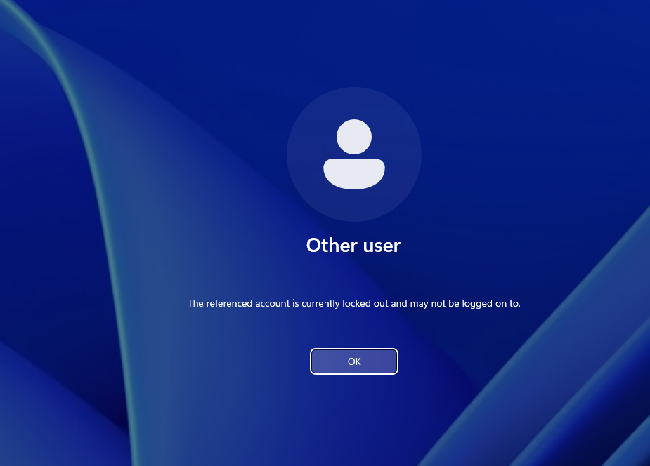
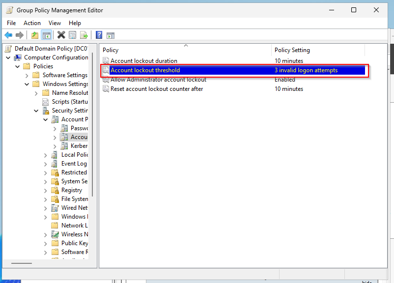
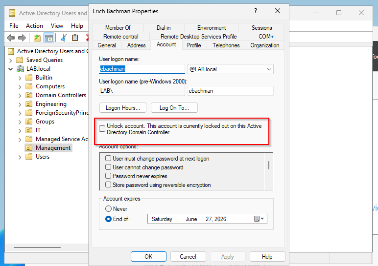
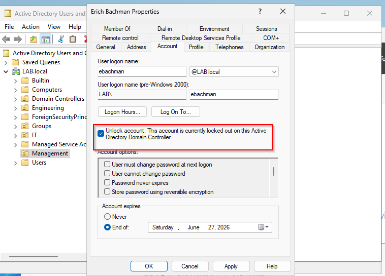
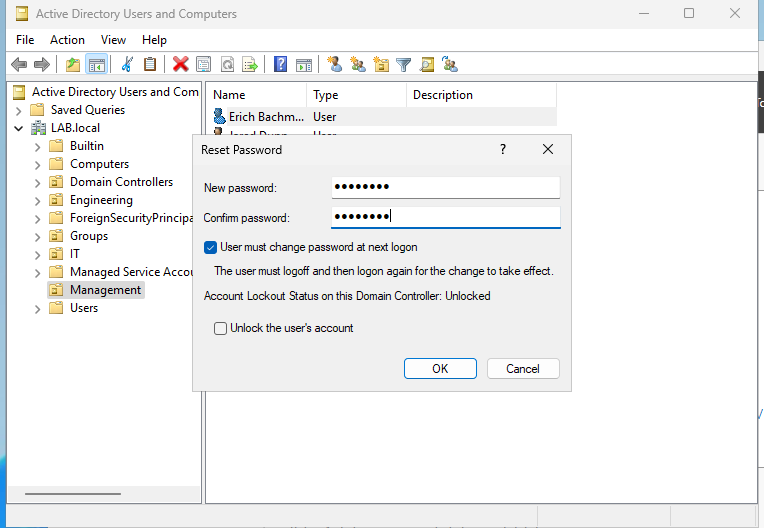
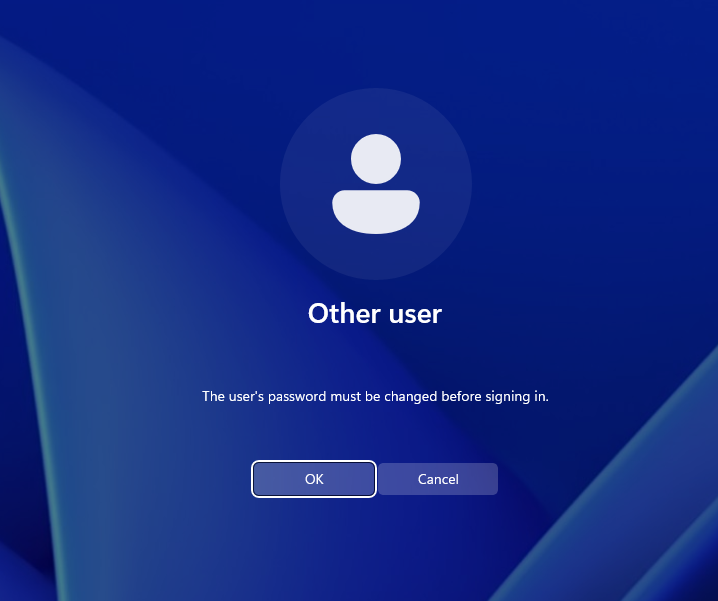
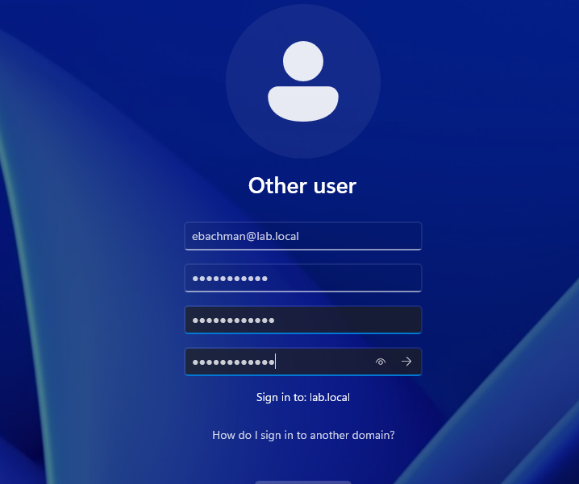

# AD-001 — Account Lockout (Unlock + Verification)

## Ticket Scenario
**User Impact:** User cannot log in to their domain workstation due to account lockout.  
**Priority:** Medium (High if user cannot begin shift).  
**Category:** Identity & Access → Active Directory → Account Lockout

---

## Symptoms
- User login fails after multiple incorrect password attempts.
- Message may indicate the account is locked out (varies by policy).

---

## Environment
- **Domain Controller:** Windows Server (AD DS + DNS)
- **Client:** Windows 10/11 domain-joined workstation (VirtualBox)
- **Domain:** lab.local
- **User:** `Eric Bachman` (lab account)

- For this lab we first confirm the lock out policy is active by going into our Group Policy Management (gpmc.msc) then going to: Forest > Domains > Domain Name > Default Domain Policy and editing and check: Computer Configuration > Policies > Windows Settings > Security Settings > Account Policies > Account Lockout Policy

---

## Triage Questions (Tier 2)
- Did the user recently change their password?
- Are they logging in from multiple devices (laptop + phone + Outlook/Teams)?
- Is anyone else affected (single user vs multiple)?
- Any recent MFA/VPN/Outlook sign-in prompts that might be retrying old credentials?

---

## Troubleshooting Steps (What I did)
### 1) (Optional) Verified lockout policy
- Checked account lockout threshold and duration in Group Policy.

   

### 2) Reproduced the issue (lab simulation)
- Triggered lockout by attempting multiple invalid logins on the workstation.

### 3) Confirmed account lockout in ADUC
- Opened **Active Directory Users and Computers**
- Located user → Properties → Account tab
- Confirmed “Unlock account” was available.

### 4) Unlocked the account (and reset password if needed)
- Unlocked the account and applied the change.
- (Optional) Reset the password and required change at next logon.

### 5) Verified resolution
- Logged in successfully on the workstation using correct credentials.

---

## Root Cause (Likely)
Account lockout was triggered by repeated failed authentication attempts. In real environments, common causes include:
- User typing an old password
- Another device/service continuously retrying old credentials (Outlook/phone/VPN/mapped drives/scheduled tasks)

---

## Resolution
Unlocked the AD account (and reset password if required), then verified successful login.

---

## Verification
User successfully authenticated to the domain workstation and reached the desktop.

---

## Escalation Criteria / Next Steps (If it happens again)
Escalate or investigate further if:
- Lockouts recur repeatedly within minutes
- Multiple users are locking out
- Signs suggest a scripted/authentication loop (mail client/VPN/remote auth)

Evidence to collect before escalation:
- Timestamp of lockout
- Devices used by user (laptop/phone)
- Relevant DC Security log entries (if available)

