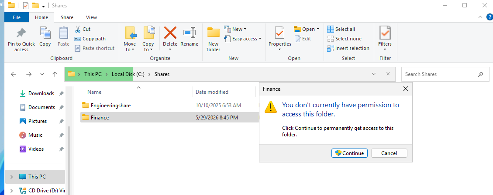
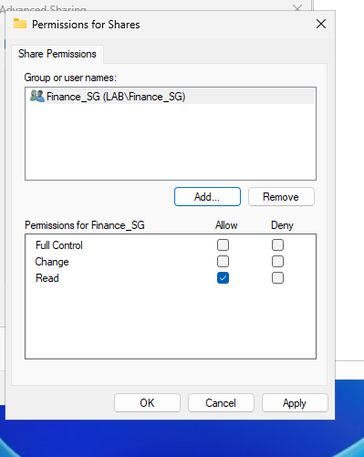
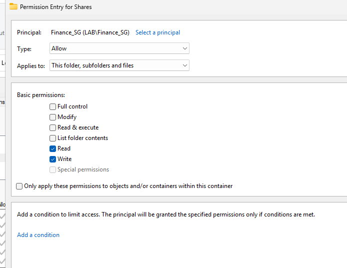
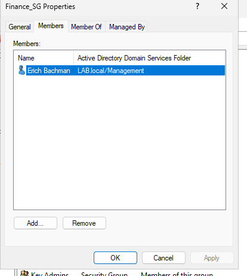
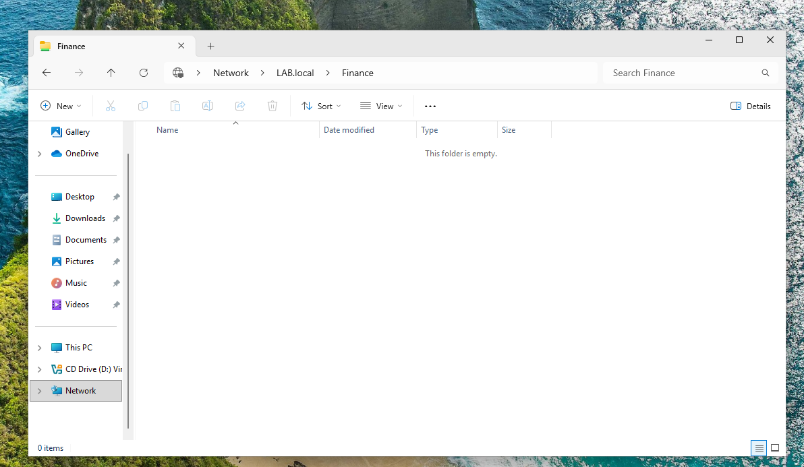

# AD-003 — File Share Access Denied (Share vs NTFS + Security Group)

## Ticket Scenario
**User Impact:** User cannot access a department file share required for work.  
**Priority:** Medium (High if required for daily operations).  
**Category:** Identity & Access → Active Directory → File Share Permissions

---

## Symptoms
- User receives **Access Denied** when opening the share path (example: `\\DCNAME\Finance`).

**Screenshot:**  

---

## Environment
- **Domain Controller:** Windows Server (AD DS + DNS + File Share)
- **Clients:** Windows 10/11 domain-joined workstations (VirtualBox)
- **Domain:** `LAB.local` (update if different)
- **Share Path:** `\\DCNAME\Finance` (update if different)
- **Access Model:** Security group-based permissions (`Finance_SG`)

---

## Triage Questions (Tier 2)
- Does this affect **one user** or **multiple users**?
- What is the exact share path and error message?
- Is the user in the required AD security group?
- Did the user recently change roles (group membership updates not yet applied)?

---

## Troubleshooting Steps (What I did)

### 1) Verified share configuration (Share Permissions)
- Confirmed the folder was shared and permissions were assigned to the correct security group.

**Screenshot:**  

### 2) Verified NTFS permissions (Security tab)
- Confirmed NTFS permissions included the same security group and appropriate access (Modify/Read).

**Screenshot:**  

### 3) Verified group membership (ADUC)
- Confirmed `UserA` was a member of `Finance_SG` (expected to have access).
- Confirmed `UserB` was **not** a member initially (expected to fail).

**Screenshot:**  

### 4) Reproduced issue as affected user
- Logged into Workstation2 as `UserB` and confirmed **Access Denied** to the share.

**Screenshot:**  

### 5) Implemented fix (Group membership)
- Added `UserB` to `Finance_SG`.

### 6) Verified resolution
- Logged off/on as `UserB` (refresh token) and confirmed access to the share succeeded.

**Screenshot:**  

---

## Root Cause
User lacked required **AD security group membership**, so Share/NTFS permissions denied access.

---

## Resolution
Added the user to the correct security group (`Finance_SG`) and verified group membership applied.

---

## Verification
User successfully accessed `\\DCNAME\Finance` after logoff/logon.

---

## Escalation Criteria / Next Steps (If unresolved)
Escalate or investigate further if:
- User is in the correct group but still denied (token not refreshed / nested groups)
- Share permissions and NTFS permissions conflict
- Inheritance/deny ACEs are present

Evidence to collect:
- Screenshots of Share + NTFS permissions
- Group membership screenshot
- Exact error text and affected path