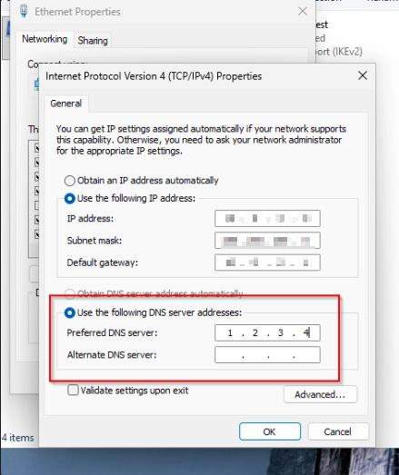
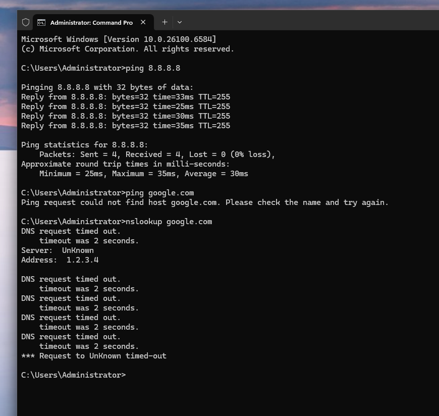
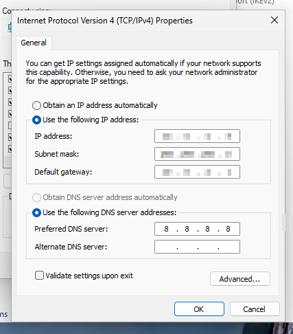
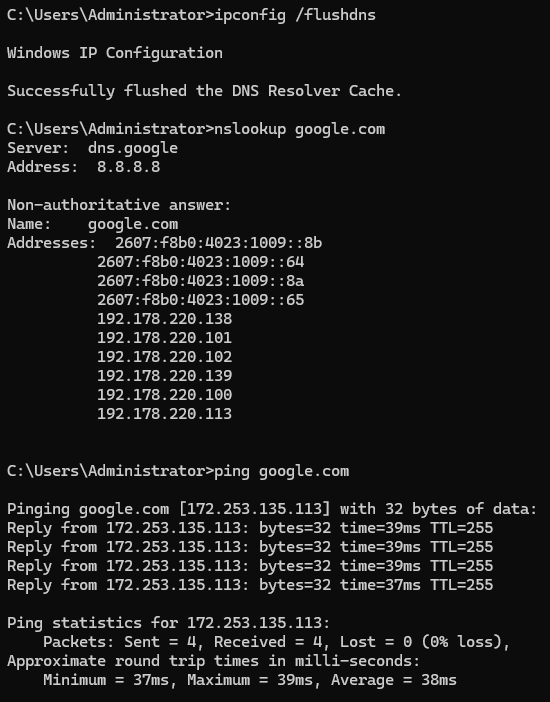

# T2-005 — “No Internet” Caused by DNS Failure (Tier 2 Triage + Fix)

## Ticket Scenario
**User Impact:** User reports “no internet” / websites won’t load. Apps that rely on hostnames (browser, Teams/Outlook sign-in, VPN gateway name, internal resources) fail.  
**Priority:** Medium (High if multiple users affected or business-critical apps down).  
**Category:** Networking → DNS / Connectivity

---

## What the user reported (Symptoms)
- Websites won’t load.
- Anything that uses names (like `google.com`) fails.
- Sometimes users say “Wi-Fi is connected but nothing works.”

**Tier 2 note:** “No internet” often isn’t a full outage. A very common root cause is **DNS failure**:
- The device may still have internet connectivity (can reach IPs),
- but can’t translate names (hostnames) into IP addresses.

---

## Environment
- Windows workstation VM (VirtualBox)
- Network: LABNET + NAT (internet access)
- DNS set at the adapter (IPv4 settings)

> Portfolio tip: It’s okay to blur internal IPs/gateway/MAC in screenshots before posting.

---

## Triage Questions (Tier 2)
1) Can the device reach an **IP address** (connectivity test)?
2) Can the device resolve a **hostname** (DNS test)?
3) Is this one device or multiple?
4) Any recent changes (VPN, Wi-Fi change, adapter settings, updates)?

---

## Step-by-step Troubleshooting (with screenshots)

### Step 1 — Reproduce a DNS failure (simulate the ticket)
**Goal:** Create a controlled failure to demonstrate Tier 2 troubleshooting.

Action:
- Open adapter IPv4 settings and set a **bad/non-working DNS server**.

**Screenshot (bad DNS set):**  

**What this proves:**  
If DNS is wrong, Windows might still reach the internet by IP, but **name resolution will fail**.

---

### Step 2 — Confirm it’s DNS (IP works, name fails)
**Goal:** Show the Tier 2 “signature” of DNS issues.

Run:
- `ipconfig /flushdns` (clears local DNS cache so we’re not seeing old results)
- `nslookup google.com` (direct DNS resolution test)
- `ping google.com` (hostname test)

**Screenshot (DNS timeout / hostname fails):**  

**How to interpret the results:**
- `nslookup google.com` timing out = the configured DNS server is not responding / unreachable.
- `ping google.com` “could not find host” = Windows cannot resolve the name to an IP.
- This is why the user experiences “no internet” even if the network link is up.

> Important: Pinging `8.8.8.8` can still succeed during DNS failures because it bypasses DNS (you’re using an IP).

---

### Step 3 — Fix the DNS configuration (restore working resolution)
**Goal:** Set DNS back to a known-good resolver.

Action:
- Update IPv4 DNS servers to working values (example: public DNS or correct internal DNS).

**Screenshot (DNS fixed):**  

---

### Step 4 — Verification (prove it’s resolved)
**Goal:** Confirm name resolution works again (required for ticket closure).

Run:
- `ipconfig /flushdns`
- `nslookup google.com`
- `ping google.com`

**Screenshot (nslookup/ping success):**  

**Close criteria:**
- `nslookup` returns results (no timeout)
- Hostnames resolve successfully and browsing works

---

## Root Cause
DNS was misconfigured (pointing to a non-working DNS server), preventing hostname resolution and causing “internet appears down” symptoms.

---

## Resolution
Restored correct DNS servers in the adapter IPv4 settings and cleared the DNS resolver cache.

---

## Escalation Criteria (when Tier 2 escalates)
Escalate to Network/Systems if:
- Multiple users/devices affected (possible DHCP/DNS outage)
- DNS is supposed to be assigned by DHCP but keeps reverting
- Gateway is unreachable (not just DNS)
- DNS service issues suspected on DC/router/firewall

**Evidence to include:**
- Screenshot of DNS settings (before/after)
- `nslookup` timeout output
- Scope (single device vs multiple)
- Any recent changes (VPN, network switch, policy)