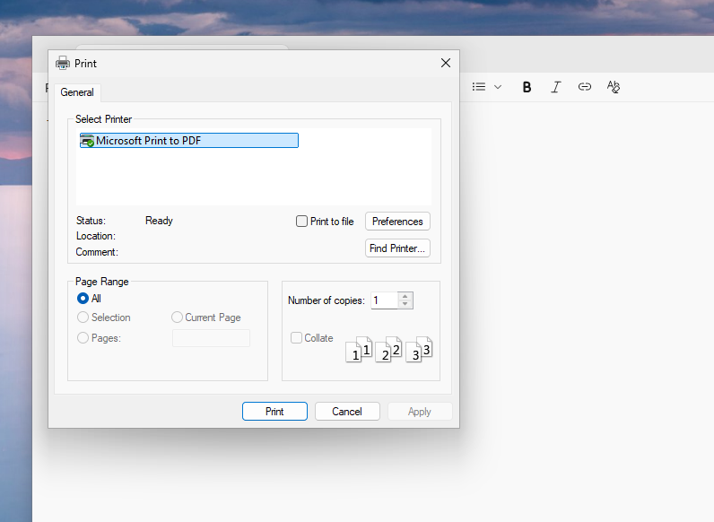
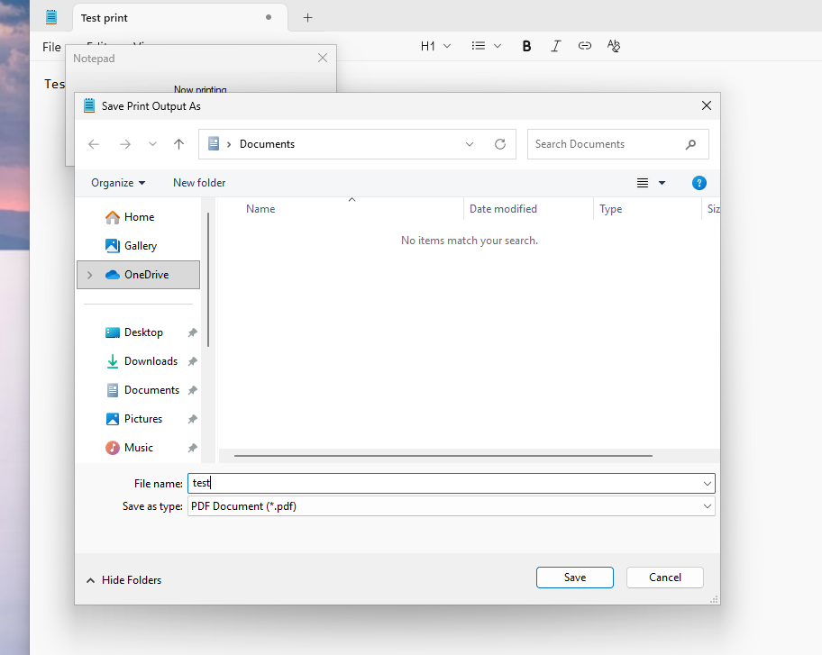
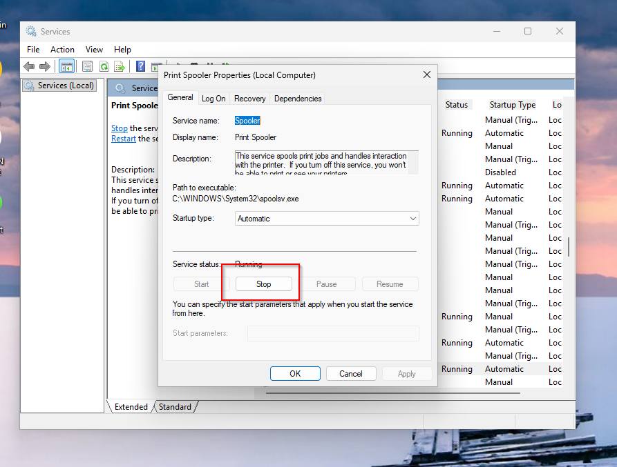
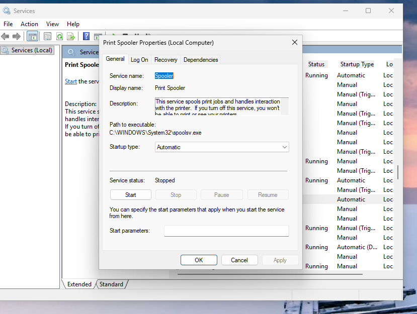
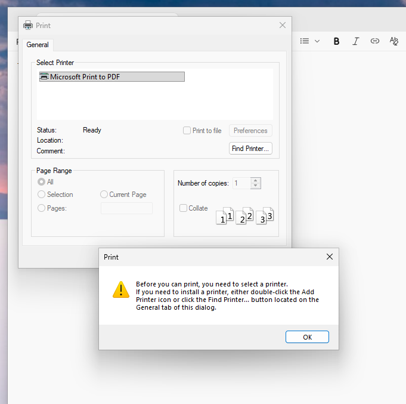
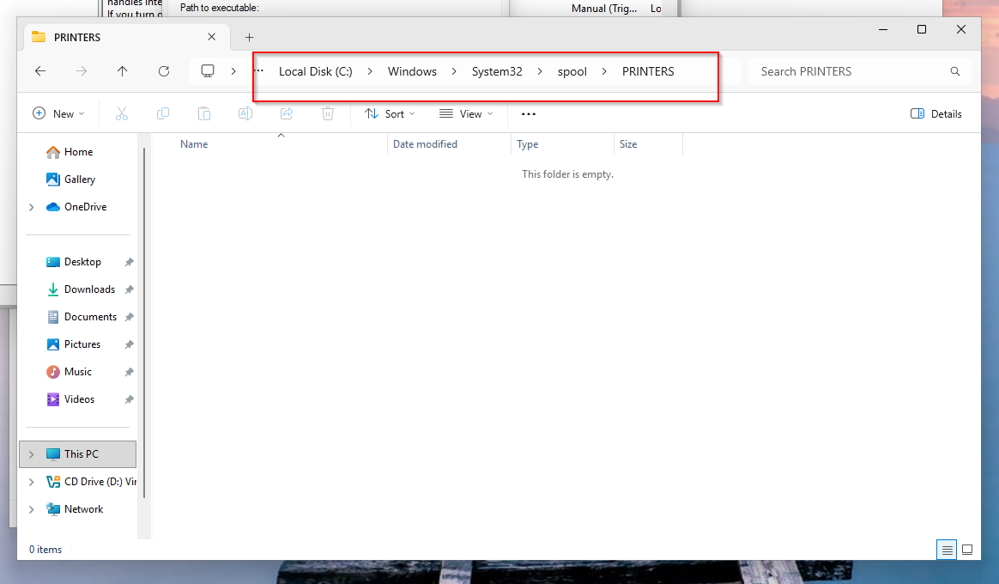

# T2-001 — Printer Queue Stuck / Not Printing (Spooler Reset + Verification)

## Ticket Scenario
**User Impact:** User cannot print; jobs are stuck in queue or fail to complete.  
**Priority:** Medium (High if printing blocks operations).  
**Category:** Desktop Support → Printers

---

## Symptoms
- Print jobs stall in queue or fail to process.

## Environment
- Windows workstation VM (VirtualBox)
- Printer: Microsoft Print to PDF (lab simulation)

---

## Evidence (Screenshots)
  
  
  

  
  

---

## Triage Questions (Tier 2)
- Is the issue affecting one user or multiple users?
- USB printer or network printer?
- Any recent driver/Windows updates?
- Is the printer showing offline or any hardware errors?

---

## Troubleshooting Steps (What I did)

### 1) Confirmed baseline printing worked
- Printed a test document to Microsoft Print to PDF and confirmed output.

### 2) Reproduced issue by stopping Print Spooler
- Stopped the Print Spooler service to simulate stuck queue behavior.

### 3) Restarted Print Spooler (primary fix)
- Started/restarted Print Spooler and re-tested printing.

### 4) (Optional) Purged spool files if queue remained stuck
- Stopped spooler → cleared `C:\Windows\System32\spool\PRINTERS` → started spooler → re-tested.

---

## Root Cause (Lab)
Print spooler service stopped or queue stalled, preventing print jobs from processing.

---

## Resolution
Restarted Print Spooler and verified printing resumed (lab simulation using Print to PDF).

---

## Verification
- Successful test print after remediation (PDF output created/opened).

---

## Escalation Criteria
Escalate if:
- Multiple users impacted (possible print server/printer outage)
- Driver corruption requires packaged driver deployment
- Hardware errors persist (jam, toner, maintenance)